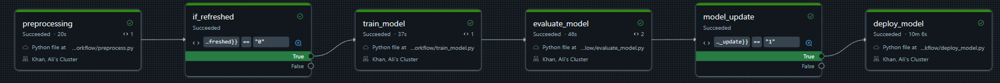

# CreditGuard: End-to-End ML Pipeline for Credit Default Prediction

This project implements an end-to-end machine learning pipeline for predicting credit card defaults using the "Default of Credit Card Clients" dataset. The pipeline includes data cleaning, preprocessing, feature engineering, model training with MLflow tracking, and model serving with A/B testing capabilities.

## Architecture Overview

The project is built using Databricks, leveraging its unified analytics platform for:
- Data processing with Spark and pandas
- ML model development with scikit-learn and LightGBM
- Model tracking and registry with MLflow
- Model serving using Databricks Model Serving endpoints
- Feature Store integration for online inference

## Deployment Pipeline

The automated deployment pipeline ensures continuous integration and delivery of the ML model:

## Project Structure

### 1. Data Cleaning (`data_cleaning.py`)
- Loads raw credit card default data
- Performs data validation and cleaning operations
- Applies value corrections for specific columns (Education, Marriage, Pay)
- Handles column renaming and capitalization

### 2. Preprocessing (`preprocessing.py`)
- Takes cleaned data from the previous step
- Applies feature scaling with RobustScaler to numerical features
- Splits data into training and test sets
- Saves the prepared data to Databricks catalog tables

### 3. Model Training (`train_model.py`)
- Creates balanced feature tables using SMOTE to address class imbalance
- Configures feature lookups for Databricks Feature Store integration
- Trains a LightGBM classifier with preprocessing pipeline
- Logs model, metrics, and parameters to MLflow
- Registers the trained model to the MLflow Model Registry

### 4. Model Evaluation (`evaluate_model.py`)
- Evaluates model performance on test data
- Logs evaluation metrics to MLflow
- Validates model quality before deployment

### 5. Model Deployment (`deploy_model.py`)
- Creates online tables for feature serving
- Deploys the trained model as a Databricks Serving Endpoint
- Performs load testing on the deployed model endpoint

### 6. A/B Testing (`ab_testing.py`)
- Trains and registers two model variants (A and B) with different parameters
- Creates a custom model wrapper for A/B testing based on credit ID hashing
- Deploys the A/B test setup as a Databricks Serving Endpoint

## Key Features

### Data Processing
- Handles missing values and data type conversions
- Applies domain-specific value corrections
- Robust feature scaling for monetary columns

### Model Training
- Addresses class imbalance with SMOTE oversampling
- Leverages Feature Store for feature management and lookup
- Uses LightGBM classifier with hyperparameter configuration
- Full MLflow integration for experiment tracking

### Deployment & Serving
- Deploys models as real-time serving endpoints
- Implements deterministic A/B testing based on customer ID hashing
- Supports automatic scaling with `scale_to_zero_enabled`

## Configuration Management

The project uses a centralized configuration file (`project_config.yml`) to manage:
- Catalog and schema names for data storage
- Model hyperparameters
- Feature configurations
- A/B testing parameters

## Prerequisites

- Databricks workspace with Unity Catalog enabled
- Python environment with required dependencies (pandas, scikit-learn, LightGBM, etc.)
- Access to the credit card default dataset

## Getting Started

1. Upload the dataset to your Databricks environment
2. Create a `project_config.yml` file with your configuration settings
3. Run the notebooks in sequence following the established workflow
4. Monitor the model training and performance metrics in MLflow
5. Use the deployed endpoints for real-time default predictions

## Best Practices Implemented

- Clean separation of concerns between data cleaning, preprocessing, and model training
- Consistent logging throughout the pipeline
- Error handling with appropriate exception raising
- Configuration-driven approach with centralized settings
- Use of MLflow for model versioning and tracking
- Integration with Databricks Feature Store for feature management
- A/B testing capability for model evaluation

## Future Enhancements

- Add monitoring dashboards for model performance
- Implement automated retraining pipelines
- Expand feature engineering with additional domain-specific features
- Add model explainability using SHAP values
- Implement automated model validation gates

## License

This project is licensed under the MIT License. See the [LICENSE](LICENSE) file for more details.
